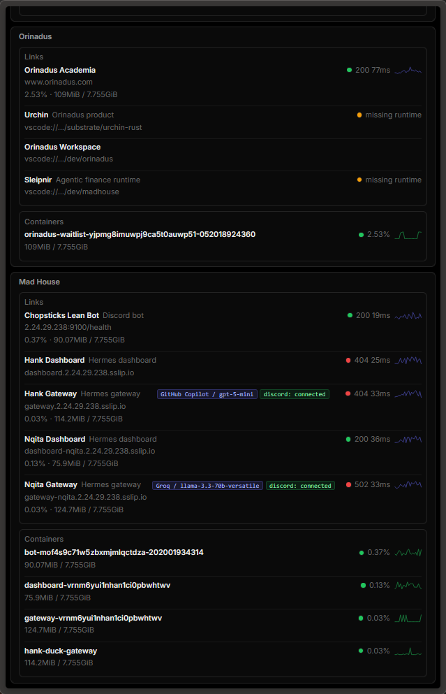
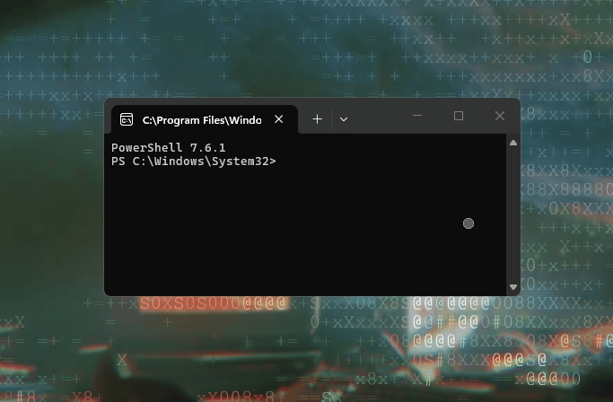
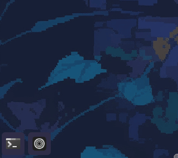
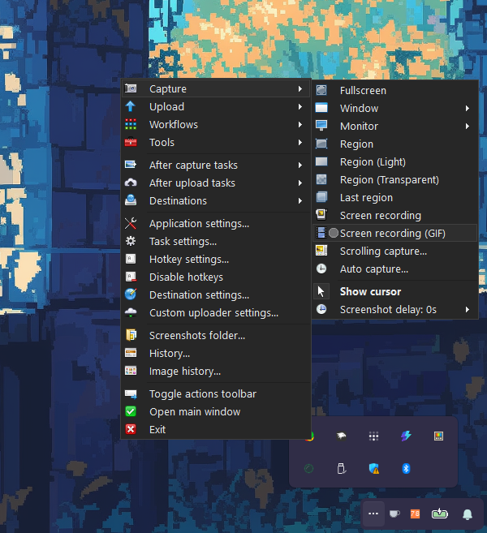

<div align="center">
  
</div>

> Everything inside my laptop, what I use / daily drive etc... Copy everything here and you basically have my laptop setup internally and externally! 

## The Setup


*Active wallpaper: ASCII art scene (May 2026)*

---

## My Dashboard

I built a personal local dashboard to view all my services, containers, and workspace shortcuts at a glance.

<div align="center">
  
</div>

Live ping and status for all Orinadus and Mad House services, container memory usage, and direct VSCode workspace links. One tab covers everything.

---

## PowerToys

I use four utilities from [Microsoft PowerToys](https://github.com/microsoft/PowerToys):

| Utility | Use |
|---|---|
| **Awake** | Keep the machine awake without changing power settings |
| **Color Picker** | Pick any color off-screen, copy hex/rgb instantly |
| **Always on Top** | Pin any window above everything else (`Win + Ctrl + T`) |
| **Command Palette** | App launcher and quick command runner |

**Always on Top in action:**

<div align="center">
  
</div>

---

## Windows Mods: Windhawk

[Windhawk](https://windhawk.net) for system-level mods. See [`windows/windhawk.md`](windows/windhawk.md) for the full setup.

<div align="center">
  
</div>

*Per-app volume. Scroll over any taskbar button to control that app's volume independently.*

---

## Browser: Zen

[Zen](https://zen-browser.app) is Firefox-based with vertical tabs and one profile per workspace.

**Favorite site: [fmhy.net](https://fmhy.net).** Used almost daily, mainly the streaming tab.

---

## Security: Bitwarden

[Bitwarden](https://bitwarden.com) is my single source of truth for everything sensitive:

- **Passwords:** every service account
- **API keys:** Cloudflare, OpenAI, GitHub, etc.
- **PATs:** GitHub personal access tokens
- **Secrets:** env vars, signing keys, webhook secrets
- **Secure notes:** SSH fingerprints, VPS access notes, recovery codes

Browser extension + desktop app + `bw` CLI for scripting.

---

## Networking: Tailscale

[Tailscale](https://tailscale.com) connects all my machines and the VPS into a private mesh with no open ports and no VPN config.

- Windows host
- WSL2 (inherits the host's Tailscale node)
- VPS (Hostinger)

Used to reach Coolify admin, SSH into the VPS, and access internal services across devices.

---

## VPS: Hostinger + Coolify

**Host:** Hostinger KVM VPS  
**Management:** [Coolify](https://coolify.io), self-hosted PaaS running on the VPS

Coolify manages all running services: Discord bots, API gateways, agent runtimes, dashboards. Everything runs in containers. No manual SSH deploys.

---

## Media Capture: ShareX

[ShareX](https://getsharex.com) for screenshots, region capture, and GIF recording.

<div align="center">
  
</div>

---

## Memory: MemReduce

[MemReduce](https://memreduct.org) runs in the tray and trims working set memory across all processes on demand. Keeps things snappy on a Windows machine running WSL2, multiple browser profiles, and a full dev stack.

---

## Custom Cursor

<div align="center">
  
  <br>
  <b><a href="assets/cursor/">Download the cursor files</a></b>
  <br>
  <sub>Apply via Control Panel > Mouse > Pointers > Browse</sub>
</div>

---

## Full Stack Reference

| Layer | Tool | Notes |
|---|---|---|
| **OS** | Windows 11 + WSL2 Ubuntu | Primary build surface is WSL |
| **Terminal** | Windows Terminal | WSL2 + PowerShell profiles |
| **Shell** | Bash (modular) | `bash/` in this repo |
| **Editor** | [Zed](https://zed.dev) | Primary editor |
| **IDE** | [VS Code](https://code.visualstudio.com) | WSL remote, heavy-duty work |
| **Browser** | [Zen](https://zen-browser.app) | Vertical tabs, Firefox base |
| **Vault** | [Obsidian](https://obsidian.md) | PARA brain at `~/brain` |
| **Secrets** | [Bitwarden](https://bitwarden.com) | All passwords, API keys, PATs |
| **Mesh** | [Tailscale](https://tailscale.com) | Private device network |
| **VPS host** | Hostinger KVM | Always-on runtime |
| **PaaS** | [Coolify](https://coolify.io) | Self-hosted on the VPS |
| **Capture** | [ShareX](https://getsharex.com) | Screenshots + GIF recording |
| **Memory** | [MemReduce](https://memreduct.org) | RAM trimmer, system tray |
| **Mods** | [Windhawk](https://windhawk.net) | System-level Windows mods |
| **Utils** | [PowerToys](https://github.com/microsoft/PowerToys) | Awake, Color Picker, Always on Top, Command Palette |
| **Theme** | Rose Pine | Taskbar via Windhawk Taskbar Styler |

---

## WSL2 Stack

```
bash/
├── .bashrc              Entry point, loads config modules
├── .bash_profile
└── config/
    ├── 00-options.sh    Shell options
    ├── 10-exports.sh    PATH + env vars
    ├── 20-aliases.sh    Aliases
    ├── 30-functions.sh  Shell functions
    ├── 40-completion.sh Completions
    └── 90-prompt.sh     Prompt
git/                     Conventional commits, global ignore, commit template
vim/                     Plugin-free vimrc
tmux/                    Session persistence
editor/                  .editorconfig
```

---

## Quick Start

```bash
git clone https://github.com/samhcus/my-laptop.git ~/.dotfiles
cd ~/.dotfiles
./install.sh
```

Symlinks `bash`, `git`, `vim`, `tmux`, and `editorconfig` into `$HOME`. Backs up anything it would overwrite into `~/.dotfiles-backup/<timestamp>/`.
